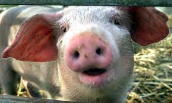

# _Pig Dice_

#### By _Liam Campbell_
#### By _Ales McKnight_

#### _A Dicing Game_

## Technologies Used

* _HTML_
* _Jquery_
* _JavaScript_
* _CSS_
* _Bootstrap_

## Description

_{This is a detailed description of your application. Give as much detail as needed to explain what the application does as well as any other information you want users or other developers to have.}_

## Setup/Installation Requirements

* _Clone the git repository github.com/lcmpbll/Pig-dice.git to your desktop_
* _Navigate to the top level of the directory._
* _Open index.html in your browser._
* _easy-to-understand_

## Known Bugs

* NA

## License

_Feel free to reach out via [Github](github.com.lcmpbll) to provide feedback on this project or to view my other projects._

[Copyright](LICENSE) (c) _06-13-2022_ _Liam Campbell Alex McKnight_